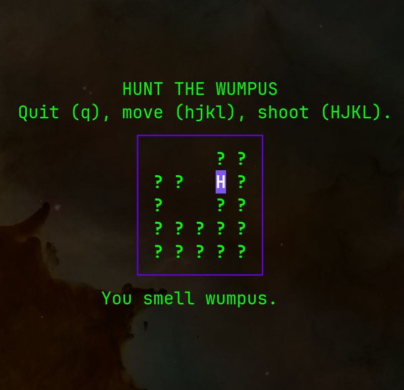

# Go Hunt the Wumpus

A small exercise to get used to the Bubble Tea library in Go. 

Original code was based on a Bubble Tea code example at [github/charmbracelt](https://github.com/charmbracelet/bubbletea/discussions/818).

  

